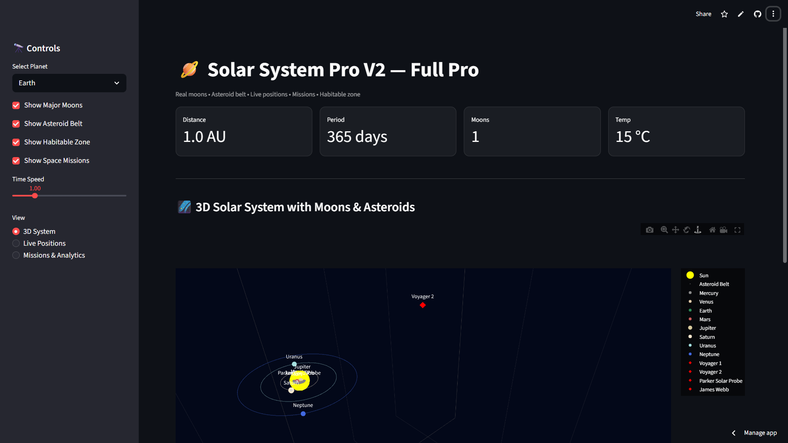
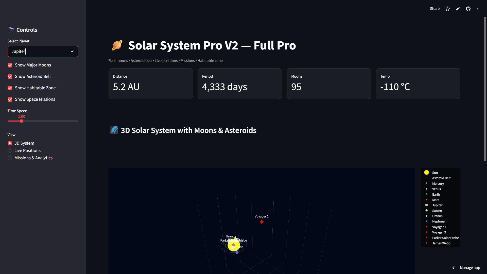
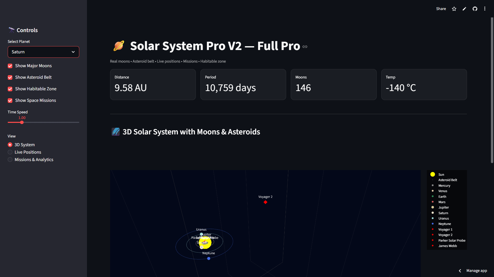
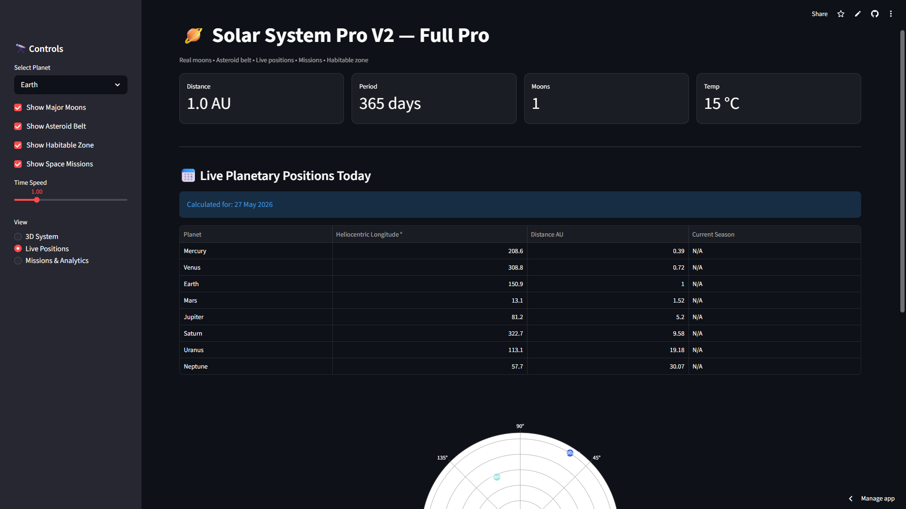
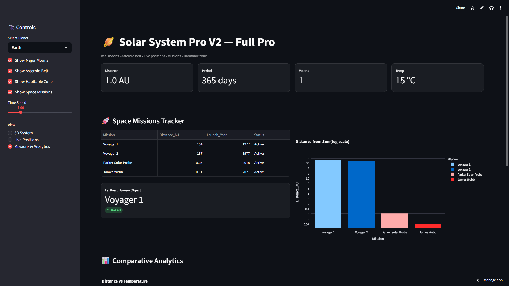

# 🪐 Solar System Pro V2 — Full Pro

[](https://solar-system-pro-9vmm8tlpkmzbpeywcokmw8.streamlit.app/)
[](https://www.python.org/)
[](https://streamlit.io)
[](https://plotly.com)
[](LICENSE)

An interactive data analytics portfolio project for exploring our Solar System with **real NASA data, 3D orbits, moons, asteroid belt and space missions tracker**. Built to showcase EDA, visualization and storytelling skills.

## ✨ Features

**3D Solar System Explorer**
- Real-time 3D orbits for all 8 planets
- Major moons for Earth, Mars, Jupiter, Saturn
- Asteroid Belt with 500+ asteroids
- Habitable Zone visualization
- Space missions: Voyager 1/2, Parker Solar Probe, James Webb

**Live Positions Dashboard**
- Heliocentric longitude calculated for today's date
- Polar plot view of planetary positions
- Distance and orbital data table

**Missions & Analytics**
- Active deep space missions tracker
- Distance from Sun log-scale chart
- Comparative analytics: Distance vs Temperature
- Export planetary data as CSV

**Interactive Controls**
- Planet selector with live KPIs
- Toggle layers: Moons / Asteroids / Habitable Zone / Missions
- Time speed control for orbit animation
- 3 view modes: 3D System, Live Positions, Missions

## 📸 Screenshots

### 3D System — Earth View


### 3D System — Jupiter View


### 3D System — Saturn View


### Live Planetary Positions


### Missions & Analytics


## 🛠 Tech Stack

- **Python 3.10+**
- **Streamlit** — Web app framework
- **Plotly** — 3D interactive visualizations
- **Pandas / NumPy** — Data processing
- **NASA JPL Data** — Planetary constants

## 🚀 Run Locally

```bash
git clone https://github.com/akash1234-design/solar-system-pro.git
cd solar-system-pro
pip install -r requirements.txt
streamlit run app_solar.py
